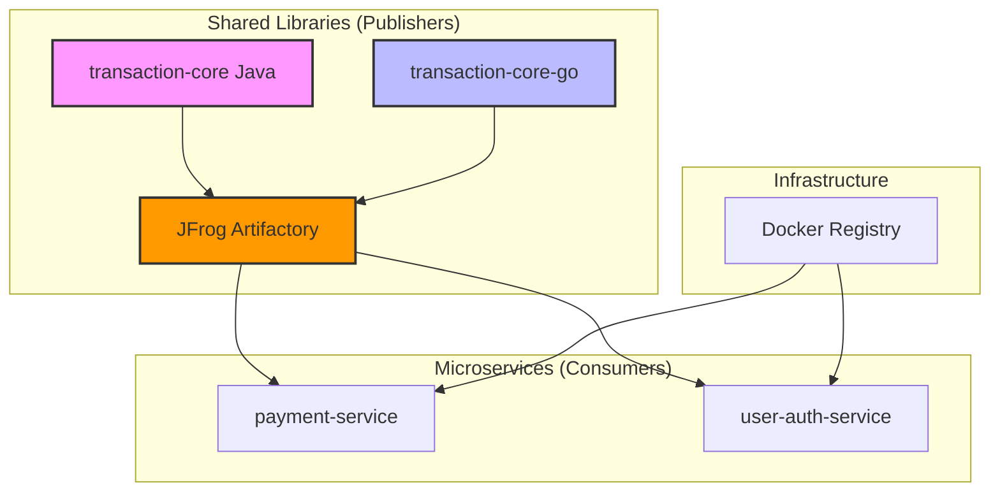
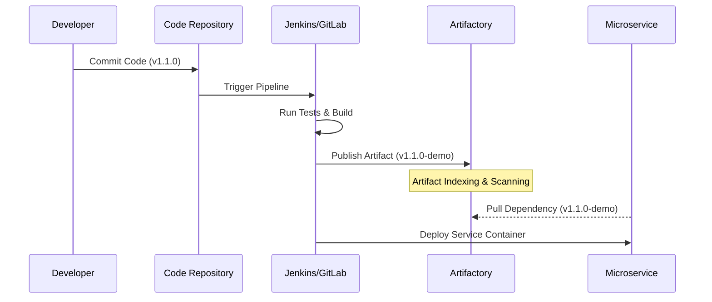

# Artifactory Automation & CI/CD Excellence 🚀

**An Enterprise-Grade Blueprint for Artifact Lifecycle Management in Multi-Language Microservices Architecture**

---


This repository serves as a comprehensive demonstration of professional **Artifact Management** within modern DevSecOps pipelines. By leveraging **JFrog Artifactory** as the central "Source of Truth," it showcases a robust, scalable workflow for **Java**, **Go**, and **Docker** ecosystems, simulating a high-performance financial technology environment.

---

## 🏗️ System Architecture

The following diagram illustrates the relationship between shared libraries and the microservices that consume them.



---

## 📖 Table of Contents

- [🌟 Introduction](#-introduction)
- [💡 The Strategic Value](#-the-strategic-value)
- [📂 Project Structure](#-project-structure)
- [🔄 CI/CD Life Cycle](#-cicd-life-cycle)
- [🛠️ Integration Guide](#-integration-guide)
- [⚙️ Automation Engine](#-automation-engine)
- [💻 Technology Stack](#-technology-stack)

---

## 🌟 Introduction

In high-velocity engineering teams, the ability to share immutable, versioned code components is critical. Manual artifact handling or inconsistent build environments lead to **version drift**, **security gaps**, and the dreaded "it works on my machine" syndrome.

This project implements the **"Build Once, Deploy Anywhere"** philosophy:
- **Immutability**: Once an artifact is versioned (e.g., `1.0.0-demo`), it is never altered.
- **Centralized Governance**: All binary assets are subject to audit and control.
- **Micro-Dependency Management**: Decoupling services while maintaining strong contracts via shared libraries.

---

## 💡 The Strategic Value

| Feature | Impact without Centralization | Impact with Centralized Artifacts |
| :--- | :--- | :--- |
| **Consistency** | High risk of environment-specific bugs. | Guaranteed parity across Dev, Staging, and Prod. |
| **Build Speed** | Redundant recompilation of libraries. | Sub-second dependency resolution via caching. |
| **Security** | Opaque third-party dependencies. | Transparent scanning and "Vetting" of binaries. |
| **Scalability** | Manual updates create bottlenecks. | Automated, versioned releases enable rapid growth. |

---

## 📂 Project Structure

A clean, modular organization designed for clarity and scalability:

```bash
artifact-publishing-demo/
├── ☕ transaction-core/       # Java Shared Library (Gradle-based)
├── 💳 payment-service/        # Java Microservice (Consumer)
├── 🔐 user-auth-service/      # Java Microservice (Consumer)
├── 🐹 transaction-core-go/    # Go Shared Library
├── 🐳 docker/                 # Production-Ready Containerization
├── 📜 scripts/                # DevSecOps Automation Utilities
│   ├── publish-artifact.sh    # Artifactory Upload Logic
│   └── fetch-artifact.sh      # Dependency Resolution Logic
└── 📊 demo-data/              # Mock Datasets for Sandbox Testing
```

---

## 🔄 CI/CD Life Cycle



---

## 🛠️ Integration Guide

### 1. Java Ecosystem (Maven/Gradle)
To consume the enterprise library, update your `build.gradle` with the verified coordinate:

```gradle
repositories {
    maven { url "https://artifactory.demo.com/artifactory/maven-repo" }
}

dependencies {
    implementation 'global.demo:transaction-core:1.0.0-demo'
}
```

### 2. Go Ecosystem
Integrate the shared Go module directly:

```go
import "github.com/demo/transaction-core-go"

func main() {
    // Process a secure transaction via the shared core
    transactioncore.ProcessTransaction("TX-DEMO-99")
}
```

### 3. Containerization
Build the production-ready image using the latest verified artifacts:

```bash
cd docker
./build.sh --version=1.0.0-demo
docker run -it --rm payment-service:demo
```

---

## ⚙️ Automation Engine

Below is a conceptual **Jenkinsfile** demonstrating how the automation facilitates the transition from code to artifact.

```groovy
pipeline {
    agent any
    
    options {
        timeout(time: 30, unit: 'MINUTES')
        buildDiscarder(logRotator(numToKeepStr: '10'))
    }

    stages {
        stage('Quality Gate') {
            steps {
                sh './gradlew test'
            }
        }
        
        stage('Publish to Artifactory') {
            steps {
                withCredentials([usernamePassword(credentialsId: 'artifactory-creds', ...)]) {
                    sh './scripts/publish-artifact.sh'
                }
            }
        }
        
        stage('Security Posture') {
            steps {
                echo "Triggering Xray Scan for Published Artifact..."
            }
        }
    }
    
    post {
        always {
            cleanWs() // Crucial for ephemeral agent health
        }
    }
}
```

> [!TIP]
> **Why `cleanWs()`?** It prevents disk saturation and ensures that next builds start from a pristine state, eliminating "Ghost Failures" caused by leftover artifacts.

---

## 💻 Technology Stack

*   **Languages**: Java 17+, Go 1.20+
*   **Build Tools**: Gradle, Go Modules
*   **Infrastructure**: Docker, Kubernetes (Simulated)
*   **Artifact Store**: JFrog Artifactory
*   **Pipeline**: Jenkins / GitLab CI
*   **Protocols**: REST API, JSON, gRPC

---

**Build Once • Publish Anywhere • Consume Securely**
