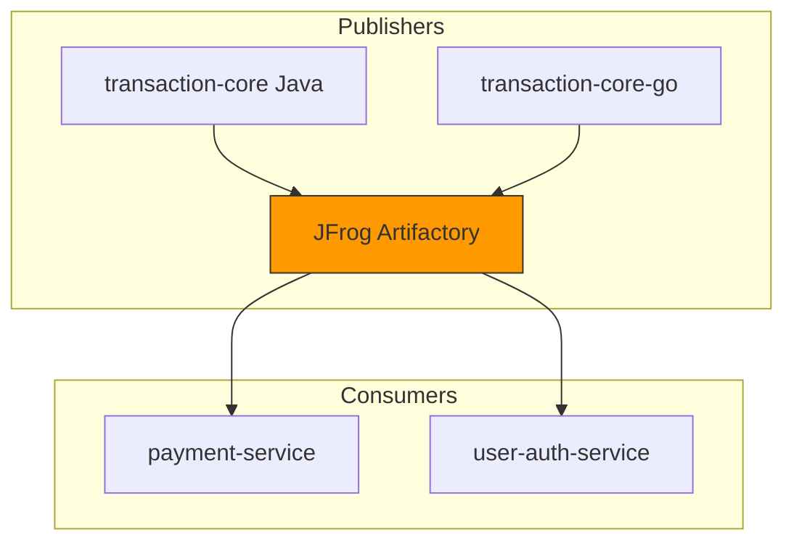

# Artifactory Automation 🚀

**Enterprise Artifact Management for Multi-Language Microservices**

---


A comprehensive blueprint for **publishing, managing, and consuming artifacts** within modern CI/CD pipelines. This project demonstrates a unified workflow for **Java**, **Go**, and **Docker**, ensuring consistency and security across the ecosystem.

---

## 🏗️ System Architecture



---

## 📂 Project Overview

*   **☕ transaction-core**: Java Shared Library (Gradle).
*   **🐹 transaction-core-go**: Go Shared Library.
*   **💳 Services**: Payment & Auth microservices consuming shared cores.
*   **📜 scripts/**: Automation for publishing (`publish-artifact.sh`) and fetching (`fetch-artifact.sh`).
*   **🐳 docker/**: Production-ready containerization.

---

## 🛠️ Usage & Integration

### 1. Java (Gradle)
```gradle
repositories { maven { url "https://artifactory.demo.com/artifactory/maven-repo" } }
dependencies { implementation 'global.demo:transaction-core:1.0.0-demo' }
```

### 2. Go
```go
import "github.com/demo/transaction-core-go"
// ...
transactioncore.ProcessTransaction("TX-DEMO-01")
```

### 3. Containerization
```bash
cd docker && ./build.sh --version=1.0.0-demo
```

---

## ⚙️ CI/CD Pipeline (Jenkins)

```groovy
pipeline {
    agent any
    stages {
        stage('Build & Test') { steps { sh './gradlew test' } }
        stage('Publish') { 
            steps { sh './scripts/publish-artifact.sh' } 
        }
    }
    post { always { cleanWs() } }
}
```

---

## 💻 Tech Stack

- **Runtimes**: Java 17, Go 1.20
- **Containerization**: Docker
- **Orchestration**: Jenkins / GitLab CI
- **Artifacts**: JFrog Artifactory (Simulation)

---

**Build Once • Publish Anywhere • Consume Securely**
