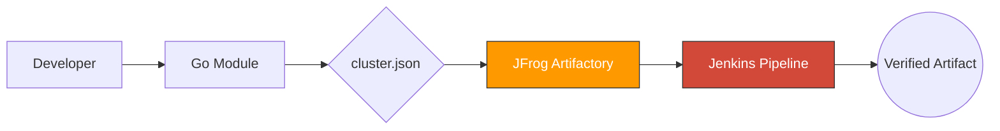

# 🚀 Artifactory-Automation

**Enterprise-Grade Workflow for Secure & Automated Artifact Management**

---


This repository demonstrates a **production-ready blueprint** for managing microservices artifacts. Highlighting security, scalability, and automation, it serves as a best-practice guide for modern DevSecOps teams.

---

## 🏗️ Architecture & Workflow

A streamlined flow from development to secure artifact storage and automated cleanup.



---

## 💡 The Problem & Solution

| Challenge | Our Solution |
| :--- | :--- |
| **Inconsistency** | Shared **Go Module** ensures uniform task execution across environments. |
| **Security Risks** | Centralized, demo-safe **`cluster.json`** for credential management. |
| **Manual Bottlenecks** | Optional **Jenkinsfile** for end-to-end CI/CD automation. |
| **Workspace Clutter** | Built-in workspace cleanup strategies for ephemeral runners. |

---

## 📂 Core Components

*   **🐹 `artifactory-manager.go`**: 
    *   Processes demo artifact/transaction data and outputs results.
    *   Validates `cluster.json` credentials for Artifactory.
    *   Simulates publishing and fetching artifacts with demo logs.
*   **🔐 `cluster.json`**: Secure repository for Artifactory endpoint credentials.
*   **⚙️ `Jenkinsfile`**: Multistage pipeline for Build, Publish, and Post-build cleanup.

---

## 🚀 Quick Start

### 1. Initialize
```bash
git clone https://github.com/your-username/artifact-publishing-demo.git
cd artifact-publishing-demo
```

### 2. Configure
Update `cluster.json` with your environment-specific credentials.

### 3. Execute
```bash
go run artifactory-manager.go
```

---

## ⚙️ Optional Automation

Use the **Jenkinsfile** to automate the workflow:

1.  **Paste the Jenkinsfile** into your Jenkins pipeline job configuration.
2.  **Trigger the automation** to execute the following stages:
    *   **Build**: Compiles and tests the source code.
    *   **Publish to Artifactory**: Securely pushes versioned artifacts to the repository.
    *   **Clean workspace**: Performed after execution to maintain agent health.

> [!TIP]
> Always ensure the `cleanWs()` step is included in your pipeline to prevent disk saturation on CI/CD agents.

---

**Build Once • Publish Safely • Automate Confidently**
